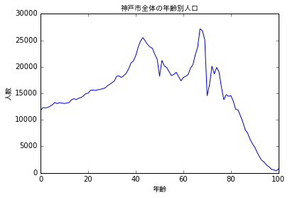
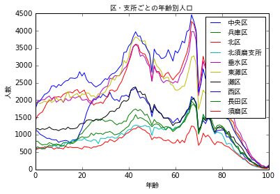
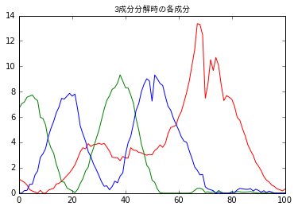
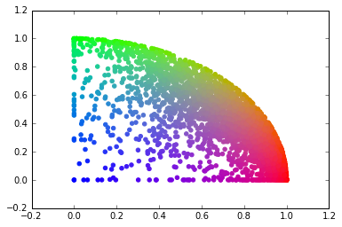
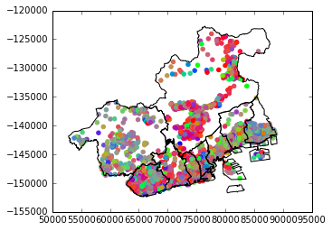

# 神戸市人口

神戸市のオープンデータに[年齢別の人口データ](http://www.city.kobe.lg.jp/information/data/statistics/toukei/jinkou/juukijinkou.html)があります。地域差は結構ありそうな予感があるので、可視化して眺めてみたいと思います。


```python
import pandas as pd
import geopandas as gpd
import sqlite3
import json
import numpy
import sklearn.decomposition
from shapely.geometry import Point
from matplotlib import pyplot as plt
```


```python
# この部分は環境依存なので適宜調整してください
%matplotlib inline
import matplotlib
jafont=matplotlib.font_manager.FontProperties(fname="ipaexg.ttf")
ja = dict(fontproperties=jafont)
```


```python
def load_zensi(fname):
    e = pd.ExcelFile(fname)
    opts = dict(skiprows=1, converters={"区コード":str, "町コード":str})
    dfs = [e.parse(s, **opts).iloc[1:,:] for s in e.sheet_names if s != "神戸市"]
    return gpd.GeoDataFrame(pd.concat(dfs, ignore_index=True))
```

一番新しいデータで分析してみます。


```python
data0 = load_zensi("../data/kobe/zensi2808.xls")
```


```python
ages=["%d歳" % i for i in range(100)]+["100歳以上"]
```

## 年齢別の人口

神戸市全体で概形を見てみます。


```python
plt.plot(data0[ages].sum().values)
plt.title("神戸市全体の年齢別人口", **ja)
plt.xlabel("年齢", **ja)
plt.ylabel("人数", **ja)
```


    <matplotlib.text.Text at 0x20ab2b7af98>





統計の集計単位の、区・支所ごとで分類して見てみます。


```python
data0g = data0.groupby("区・支所")[ages].sum()
plt.plot(data0g.T.values)
plt.title("区・支所ごとの年齢別人口", **ja)
plt.xlabel("年齢", **ja)
plt.ylabel("人数", **ja)
plt.legend(data0g.index, prop=jafont)
```


    <matplotlib.legend.Legend at 0x20ab2bf7710>





こうして見てみると、同じような成分が共通してみられます。一方で、例えば中央区と西区では子供の20歳以下の分布の形は大きく違います。年齢別の分布には実際に地域差がありそうです。

## 成分分析

NMF という手法で成分を分離してみます。


```python
data1 = data0[data0[ages].isnull().any(axis=1)==False]

import sklearn.decomposition
m = sklearn.decomposition.NMF(3)
o = m.fit_transform(data1[ages])
```

3成分に分解した各成分（年齢分布）をプロットしてみます。


```python
cc = ["rbg"[i] for i in pd.DataFrame(m.components_.dot([i*2 for i in range(101)]),
    columns=["sort_key"]).sort_values("sort_key", ascending=False).index]
```


```python
for i,r in enumerate(m.components_):
    plt.plot(r, color=cc[i])

plt.title("3成分分解時の各成分", **ja)
```


    <matplotlib.text.Text at 0x20ab54a4630>





集計地区単位ごとに、どのような重みづけで分布しているかをプロットしてみます。


```python
o2=sklearn.preprocessing.normalize(o)
o3=pd.DataFrame(o2, columns=cc)
c = o3.apply(lambda r:"#%02x%02x%02x" % tuple([int(r.get(k, 0)*255) for k in "rgb"]), axis=1)
plt.scatter(o2[:,0], o2[:,1], color=c)
```


    <matplotlib.collections.PathCollection at 0x20ab555a2b0>





## 地図上にプロット

地図上にこの集団をプロットしてみます。町名から緯度経度（代表点）を求めます。


```python
qname = data0.apply(lambda r:"神戸市 %s %s" % (r["区・支所"].replace("支所",""), r["町名"]), axis=1)
try:
    cache = pd.read_json(open("../cache/kobe.json", encoding="UTF-8")).T
except:
    cache = pd.DataFrame([], columns=["lat", "lng"])

loc = pd.DataFrame(qname, columns=["qname"]).join(cache, on="qname")
```


```python
## To rebuild cache/kobe.json, save qname
# loc[loc[["lat","lng"]].isnull().any(axis=1)]["qname"]
```


```python
geo = gpd.GeoDataFrame(pd.concat([data0, loc], axis=1))
data1 = geo[geo[["lat","lng"]].isnull().any(axis=1)==False]
pt = pd.DataFrame(data1.apply(lambda r:Point(r["lng"], r["lat"]), axis=1), columns=["geometry"])
data2 = gpd.GeoDataFrame(pd.concat([data1, pt], axis=1), crs="+init=epsg:4326")
```

e-Stat の区域データを使って区の外形線を取り出します。


```python
pib_fs = ["../data/estat/h22ka281%02d.shp" % i for i in [1,2,5,6,7,8,9,10,11]]
us = [gpd.read_file(f) for f in pib_fs]
crs = us[0].crs
pib = gpd.GeoDataFrame(pd.concat(us, ignore_index=True), crs=crs)
pib2 = pib[(pib["MOJI"]!="水面") & (pib["MOJI"].isnull()==False)] # 海上を取り除く
css = list(set(pib2["CSS_NAME"])) # 区の名前一覧

import functools
pib3 = gpd.GeoDataFrame([{"geometry":functools.reduce(lambda x,y:x.union(y), pib2[pib2["CSS_NAME"]==a].geometry), "CSS_NAME":a} for a in css])
```


```python
pib3.plot(alpha=0)
pt2 = data2.to_crs(crs)
plt.scatter(pt2.geometry.bounds.minx, pt2.geometry.bounds.miny, color=c, alpha=1.0)
```


    <matplotlib.collections.PathCollection at 0x20ab2b69a20>





地図をみる専用のアプリケーションのほうが状況がよく見えそうです。
